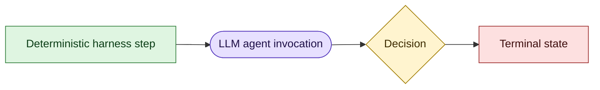
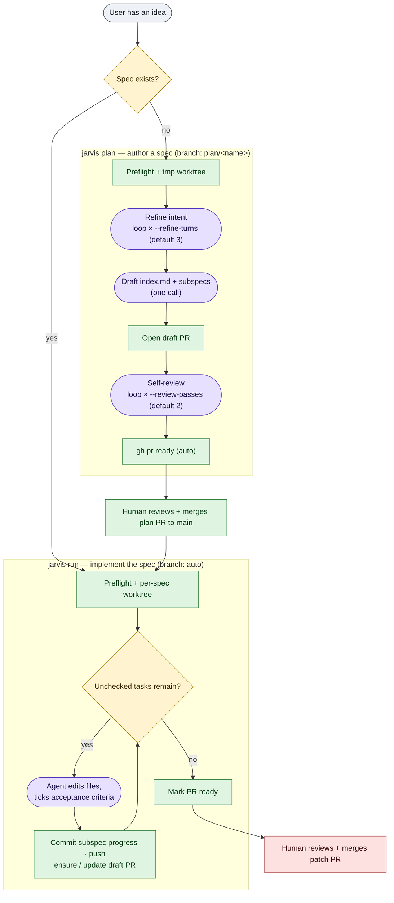
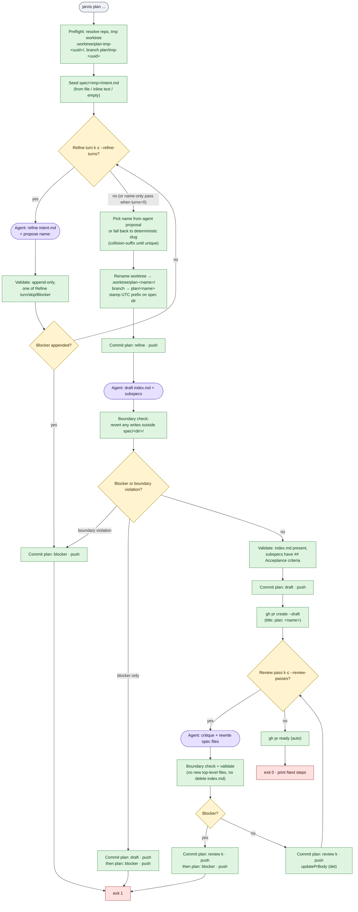
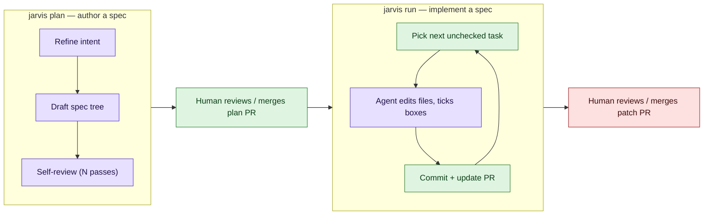

# Workflows: plan and patch

Visual reference for how `jarvis plan` and `jarvis run` (patch mode) execute.
Each diagram distinguishes deterministic harness steps from LLM-driven agent
calls, and shows where the harness loops vs. takes distinct paths.

Authoritative behavior lives in [plan-mode.md](./plan-mode.md) and
[run-loop.md](./run-loop.md); this document only summarises control flow.

`jarvis review-feedback <worktree-name>` runs one patch-mode agent pass against
actionable open PR feedback (unresolved inline review threads plus top-level
review-round comments). The target patch worktree must start clean; on success
the harness creates one commit (`address PR review comments`) and pushes it.
v1 does not auto-resolve threads, post replies, or edit PR metadata.

## Legend



- **Green rectangles** are deterministic: pure code in the harness (git ops,
  validation, PR rewrites, telemetry). Re-running the same step with the same
  inputs produces the same result.
- **Purple stadiums** are LLM-driven: one agent CLI invocation. Output is
  non-deterministic; the harness only constrains it through prompt rules,
  post-hoc validation, and the write boundary.
- **Yellow diamonds** are deterministic branch points whose direction depends
  on LLM output (e.g. "did the agent append `## Blocker`?"). The check is
  deterministic; the input that drives it is not.
- **Red rectangles** are terminal exits.

## Overview: where plan and patch meet



Plan is a **fixed pipeline**: refine → draft → review, with iteration counts
set up front by flags. Patch is a **single loop** that terminates when the
spec's checklist is empty. Both modes produce a draft PR that a human reviews
and merges. Plan never writes outside `spec/<dir>/`; patch is free to edit
anywhere in its worktree. Blocker exits, quota fallback, and the full set of
patch exit codes are deferred to the detailed diagrams below.

## Plan mode

`jarvis plan` is **phase-structured**: a fixed sequence (refine → draft →
review) where only the **refine** and **review** phases iterate, and each
iteration count is fixed up front by flags (`--refine-turns`,
`--review-passes`). The agent does not decide when to stop.



What loops vs. what's a distinct path:

- **Loops** (counts fixed before the run): refine turns and review passes.
- **Distinct phases** (run at most once per invocation): seed → refine →
  name+rename → draft → review-loop → mark-ready.
- **Quota fallback** is an *orthogonal* loop not shown above: on every agent
  call, if the chosen agent reports a quota signal, the harness rotates to the
  next agent in `modes.plan.agentOrder` and retries the same phase invocation.
  Generic agent errors *also* rotate (unlike patch mode); only `model_config`
  exits immediately with code 3.
- **Determinism**: every green box is reproducible from the same git state.
  Every purple box reads files + emits files; jarvis enforces invariants
  *after* the call (append-only on `intent.md`, write boundary, validation
  rules) but cannot make the agent's text choice deterministic.

`--resume` re-enters the diagram at the review-loop (and optionally adds
refine turns before it), reusing the existing worktree, branch, and PR.

## Patch mode (`jarvis run`)

Patch mode is **iteration-structured**: a single loop that terminates when the
spec has no unchecked checkboxes (or when an exit condition fires). The agent
chooses what work to do each iteration; the harness picks the spec, picks the
task, commits, and decides whether progress was made.

```mermaid
flowchart TD
  start([jarvis run spec/.../index.md]):::neutral

  start --> pf["Preflight: resolve repo,<br/>ensureWorktree, acquire lock,<br/>assertGhReady"]:::det
  pf --> warn["Maybe warn:<br/>unmerged plan/&lt;name&gt; on origin"]:::det
  warn --> top{"countUnchecked(spec) == 0?"}:::dec

  top -- yes --> finish["Clean tree?"]:::det
  finish --> cleanQ{"git status clean?"}:::dec
  cleanQ -- no --> dirty["exit 6: dirty worktree<br/>(point at jarvis triage)"]:::stop
  cleanQ -- yes --> ok["print spec complete + PR URL<br/>exit 0"]:::stop

  top -- no --> agentQ{"Any agent left in agentOrder?"}:::dec
  agentQ -- no --> quotaExit["exit 2: all agents quota-exhausted"]:::stop
  agentQ -- yes --> pickTask["Pick first unchecked task<br/>resolve active subspec"]:::det
  pickTask --> blkPre{"Subspec already has ## Blocker?"}:::dec
  blkPre -- yes --> blkExit["exit 7: blocker"]:::stop
  blkPre -- no --> snap["Snapshot acceptance criteria<br/>build prompt (det, rules.md inlined)"]:::det
  snap --> call(["Agent: edit files, tick checkboxes"]):::llm

  call --> kind{"result.kind?"}:::dec
  kind -- quota --> rotate["Drop agent from order<br/>telemetry: quota-fallback"]:::det --> top
  kind -- model_config --> mcExit["exit 3: model-config"]:::stop
  kind -- error --> lenient{"Lenient quota fallback applies?"}:::dec
  lenient -- yes --> rotate
  lenient -- no --> errExit["exit 3: agent-error"]:::stop

  kind -- ok --> diff["Diff acceptance criteria<br/>before / after"]:::det
  diff --> blkPost{"Blocker added this iteration?"}:::dec
  blkPost -- yes --> commitWipBlk["commitWipProgressWithBlocker · push"]:::det --> blkExit
  blkPost -- no --> allQ{"All criteria checked?"}:::dec

  allQ -- yes --> commitSub["commitSubspec · push<br/>ensureDraftPr (once) / updatePrBody<br/>maybeMarkReady"]:::det --> top
  allQ -- no --> progQ{"newlyChecked.length &gt; 0?"}:::dec
  progQ -- yes --> commitWip["commitWipProgress · push"]:::det --> top
  progQ -- no --> editedQ{"Files edited but nothing ticked?"}:::dec
  editedQ -- yes --> dirtyMid["exit 6: dirty worktree mid-run"]:::stop
  editedQ -- no --> noProg{"countUnchecked unchanged?"}:::dec
  noProg -- yes --> noprogExit["exit 4: no-progress"]:::stop
  noProg -- no --> top

  top -.->|maxIterations reached| maxExit["exit 5: max-iterations"]:::stop
  top -.->|iteration/run timeout fires| toExit["exit 8: timeout"]:::stop
  top -.->|SIGINT| sigExit["exit 130"]:::stop

  classDef det fill:#dff5e1,stroke:#2f7d3a,color:#0b3d16;
  classDef llm fill:#e7e0ff,stroke:#5b3fc0,color:#1f1147;
  classDef dec fill:#fff4cf,stroke:#a07b00,color:#3d2c00;
  classDef stop fill:#fde0e0,stroke:#9c2a2a,color:#3d0d0d;
  classDef neutral fill:#eef1f5,stroke:#4a5566,color:#1a1f29;
```

What loops vs. what's a distinct path:

- **One loop**: the top-level iteration. There is no nested "review" or
  "refine" phase. Each iteration is one agent call followed by deterministic
  bookkeeping.
- **Distinct exit paths**: `kind ∈ {ok, quota, model_config, error}` fan out
  from a single decision; the same iteration cannot take two of them.
- **Quota rotation** drops the current agent from `agentOrder` and continues
  the same loop with the next agent. Unlike plan mode, a generic `error`
  *does not* rotate — it exits 3 — except when `quotaFallback: "lenient"`
  upgrades the classification.
- **Determinism**: the agent's edits are non-deterministic, but everything
  downstream (acceptance-criteria diff, commit-shape selection, PR body
  rewrite from `generatePrBodyFromSpec`, ready-flip on completion) is pure
  function of files on disk. Re-running an iteration against the same disk
  state would commit the same thing.

Dotted edges show pre-emption — `maxIterations`, timeouts, and SIGINT can fire
at the top of any iteration before the agent call.

---

## At-a-glance (pitch view)

For an external audience: same flows, fewer branches.



Plan is a fixed pipeline of LLM steps; patch is a single loop until the spec's
checklist is empty. In both, the LLM produces text and edits; the harness
deterministically commits, pushes, updates the PR, and decides when to stop.
