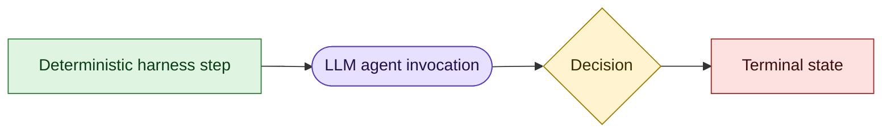
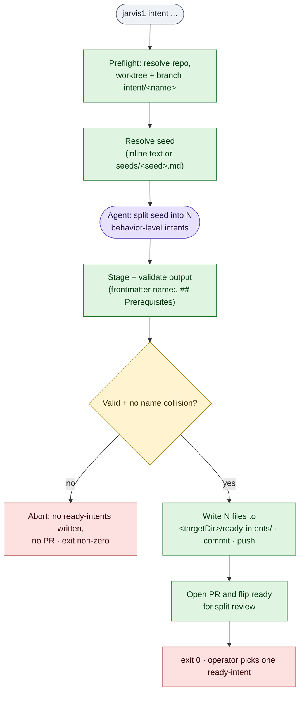
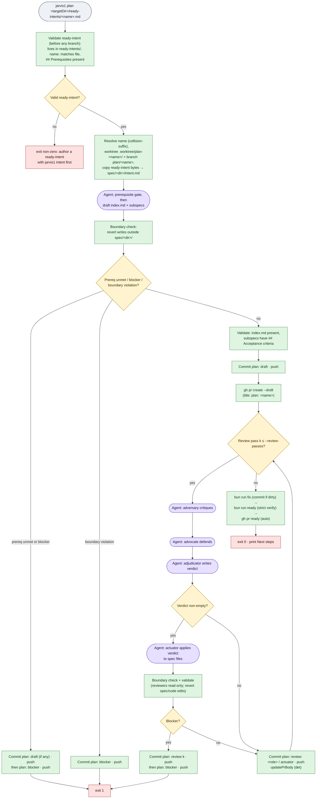
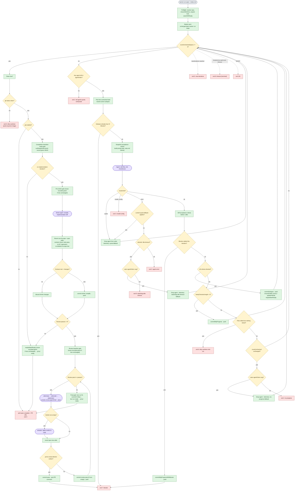
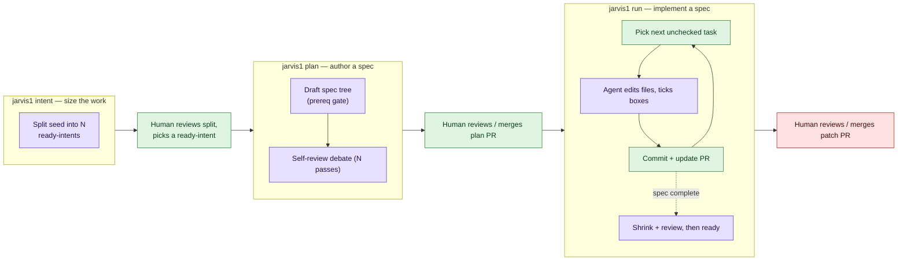

# Workflows: intent, plan, and patch

Visual reference for how `jarvis1 intent`, `jarvis1 plan`, and `jarvis1 run` (patch mode) execute. Each diagram distinguishes deterministic harness steps from LLM-driven agent calls, and shows where the harness loops vs. takes distinct paths.

The three modes chain: `jarvis1 intent` fans one seed out into authored ready-intents, `jarvis1 plan` drafts a spec tree from one ready-intent, and `jarvis1 run` implements that spec. Each stage opens its own PR for a human to review and merge before the next stage runs.

Authoritative behavior lives in [intent-mode.md](./intent-mode.md), [plan-mode.md](./plan-mode.md), and [run-loop.md](./run-loop.md); this document only summarises control flow.

`jarvis1 review-feedback <worktree-name>` runs one patch-mode agent pass against actionable open PR feedback (unresolved inline review threads plus top-level review-round comments). The target patch worktree must start clean; on success the harness creates one commit (`address PR review comments`) and pushes it. v1 does not auto-resolve threads, post replies, or edit PR metadata.

## Legend

- **Green rectangles** are deterministic: pure code in the harness (git ops,
  validation, PR rewrites, telemetry). Re-running the same step with the same
  inputs produces the same result.
- **Purple stadiums** are LLM-driven: one agent CLI invocation. Output is
  non-deterministic; the harness only constrains it through prompt rules,
  post-hoc validation, and the write boundary.
- **Yellow diamonds** are deterministic branch points whose direction depends
  on LLM output (e.g. "did the agent append `## Blocker`?"). The check is
  deterministic; the input that drives it is not.
- **Red rectangles** are terminal exits.

## Overview: where intent, plan, and patch meet

```mermaid
flowchart TD
  start([User has an idea]):::neutral
  start --> intentQ{"Ready-intent exists?"}:::dec
  intentQ -- no --> intentEntry
  intentQ -- "yes (skip ahead)" --> planQ
  planQ{"Spec tree exists?"}:::dec
  planQ -- no --> planEntry
  planQ -- yes --> runEntry

  subgraph intentMode["jarvis1 intent — fan out a seed (branch: intent/&lt;name&gt;)"]
    direction TB
    intentEntry["Preflight + worktree"]:::det
    intentEntry --> split(["Split seed into N<br/>behavior-level intents"]):::llm
    split --> writeIntents["Validate + write N files to<br/>&lt;targetDir&gt;/ready-intents/ · commit · ready PR"]:::det
  end

  writeIntents --> intentHandoff["Human reviews the split,<br/>picks one ready-intent"]:::det
  intentHandoff --> planEntry

  subgraph planMode["jarvis1 plan — author a spec (branch: plan/&lt;name&gt;)"]
    direction TB
    planEntry["Validate ready-intent + worktree<br/>(copy intent.md)"]:::det
    planEntry --> draft(["Draft: prereq gate →<br/>index.md + subspecs (one call)"]):::llm
    draft --> openDraft["Open draft PR"]:::det
    openDraft --> review(["Self-review: adversary → advocate →<br/>adjudicator → actuator<br/>(one flow per pass) × --review-passes (default 1)"]):::llm
    review --> markReady["bun run fix (commit if dirty) →<br/>bun run ready (strict verify) →<br/>gh pr ready (auto)"]:::det
  end

  markReady --> handoff["Human reviews + merges plan PR to main"]:::det
  handoff --> runEntry

  subgraph patchMode["jarvis1 run — implement the spec (branch: auto)"]
    direction TB
    runEntry["Preflight + per-spec worktree"]:::det
    runEntry --> iterLoop{"Unchecked tasks remain?"}:::dec
    iterLoop -- yes --> agentCall(["Agent edits files,<br/>ticks acceptance criteria"]):::llm
    agentCall --> commit["Commit subspec progress · push<br/>ensure / update draft PR"]:::det
    commit --> iterLoop
    iterLoop -- no --> ready["Completion-transition ready gate"]:::det
    ready --> shrink(["Shrink: simplify the<br/>implementation diff (one call)"]):::llm
    shrink --> patchReview(["Review: adversary → advocate →<br/>adjudicator → actuator<br/>(one flow per pass) × review passes (default 1)"]):::llm
    patchReview --> patchReady["Final gate + gh pr ready"]:::det
  end

  patchReady --> done["Human reviews + merges patch PR"]:::stop

  classDef det fill:#dff5e1,stroke:#2f7d3a,color:#0b3d16;
  classDef llm fill:#e7e0ff,stroke:#5b3fc0,color:#1f1147;
  classDef dec fill:#fff4cf,stroke:#a07b00,color:#3d2c00;
  classDef stop fill:#fde0e0,stroke:#9c2a2a,color:#3d0d0d;
  classDef neutral fill:#eef1f5,stroke:#4a5566,color:#1a1f29;
```

Intent is a **single split call** that sizes work before planning. Plan is a **fixed pipeline**: draft → review, with the review iteration count set up front by `--review-passes`. Patch is a **single implementation loop** that terminates when the spec's checklist is empty, followed by optional post-completion shrink and review phases. All three modes produce a PR that a human reviews and merges. Intent never drafts spec directories; plan never writes outside its spec tree; patch is free to edit anywhere in its worktree. Blocker exits, quota fallback, the prerequisite gate, and the full set of patch exit codes are deferred to the detailed diagrams below.

## Intent mode

`jarvis1 intent` is a **single agent call** that sizes work before planning: one seed (inline text or a `seeds/<seed>.md` file) fans out into N behavior-level ready-intents, each of which later drafts into one spec / one PR. It does not refine, draft spec directories, or write `index.md`.

Splitter output is staged and validated **before** anything lands in `ready-intents/`; invalid output or a `name:` collision aborts the run without partial writes and without a PR. Intent mode reuses the same repo resolution, plan agent order, and quota fallback as plan mode. The operator reviews the split on the intent PR, then runs `jarvis1 plan` on one emitted ready-intent at a time.

## Plan mode

`jarvis1 plan` **consumes a ready-intent** (`<targetDir>/ready-intents/<name>.md`) and is **phase-structured**: it starts at the **draft** phase (intent authoring/refinement now lives in intent mode), then runs a fixed number of **review** passes set up front by `--review-passes`. The agent does not decide when to stop.

What loops vs. what's a distinct path:

- **Loop** (count fixed before the run): review passes (`--review-passes`,
  default 1). Each pass is **one flow** through a three-role debate (**adversary
  → advocate → adjudicator**) followed by an **actuator** call that applies the
  adjudicator's verdict to the spec files. An empty verdict skips the actuator.
- **Distinct phases** (run at most once per invocation): validate ready-intent →
  setup → draft → review-loop → mark-ready. There is **no** refine phase and
  **no** temporary-worktree rename; the worktree/branch are created under the
  final name directly.
- **Prerequisite gate**: before drafting, the draft agent judges whether each
  behavior in the ready-intent's `## Prerequisites` section is legibly present
  in the repo. If any is unconfirmed, it appends a `## Blocker` to `intent.md`,
  writes no spec files, and plan exits non-zero. An empty / bareword-`none`
  prerequisites body skips the gate.
- **Quota fallback** is an *orthogonal* loop not shown above: on every agent
  call, if the chosen agent reports a quota signal, the harness rotates to the
  next agent in that phase's chain (`modes.plan.agentOrder` for draft; review
  uses `modes.review.agentOrder` → `modes.plan.agentOrder`). During draft a
  generic agent error *also* rotates; `model_config` rotates on draft and
  intent-split only. Review matches patch review (quota rotates, `model_config`
  exits 3, other hard errors stop the pass).
- **Determinism**: every green box is reproducible from the same git state.
  Every purple box reads files + emits files; jarvis enforces invariants
  *after* the call (write boundary, append-only on `intent.md`, validation
  rules) but cannot make the agent's text choice deterministic.
- **Readiness transition**: when every phase succeeds without a blocker,
  `jarvis1 plan` runs built-in `bun run fix` (committing any dirty output first),
  then built-in `bun run ready`, and on green calls `gh pr ready`.
  The authoritative built-in ready/fix split, gate ordering, and step order live
  in [`v2/docs/v1-behaviors.md`](../../v2/docs/v1-behaviors.md). This committed
  plan-mode call site is not wired to `readyCommand`; it runs the built-ins. If
  any gate step fails, the PR stays in draft.

`--resume` re-enters the diagram at the review-loop, reusing the existing worktree, branch, and PR. With `modes.plan.commit: false` there is no branch/worktree/PR: specs are written under `~/.jarvis/specs/...` and no commit or readiness transition runs.

## Patch mode (`jarvis1 run`)

Patch mode is **iteration-structured**: a single loop that terminates when the spec has no unchecked checkboxes (or when an exit condition fires). The agent chooses what work to do each iteration; the harness picks the spec, picks the task, commits, and decides whether progress was made.

What loops vs. what's a distinct path:

- **Implementation loop**: the top-level iteration. Each iteration is one agent
  call followed by deterministic bookkeeping. Exits when the spec has no
  unchecked boxes.
- **Completion-transition ready gate**: reached at most once per run, when a
  `git: true` run first observes zero unchecked boxes. On `full` it runs
  `bun run fix` → commit-if-dirty (and push) → strict verification →
  post-verification commit-if-dirty (and push) when applicable, and on a clean
  green records the result keyed to post-post-verification-commit HEAD + clean
  worktree (residual still-dirty porcelain after post-verification commit
  aborts at exit 6). The post-completion phases (shrink, review,
  `maybeMarkReady`) **reuse** that recorded green result and skip re-running
  verification whenever the tree is unchanged since the recording. See
  [run-loop.md](./run-loop.md#completion-transition-ready-gate).
- **Shrink phase** (post-completion): a single shrink agent call that tries to
  simplify the implementation diff. Runs only when ≥1 implementation iteration
  completed and git is enabled. Out-of-scope and spec-tree edits are reverted;
  the result is discarded unless tests pass with no acceptance-criteria
  regression and no deleted in-scope test. A surviving change becomes one
  `shrink:` commit. Order is **shrink → review → `maybeMarkReady`**.
- **Review phase** (post-completion): optional debate loop controlled by
  `modes.review.passes` (default 1). Skipped if passes is 0, git is false, or no
  implementation iteration ran. Each pass is **one flow** through a read-only
  **adversary → advocate → adjudicator** debate; a non-empty adjudicator verdict
  then drives an **actuator** call that applies it to the code. Ends with a final
  `full` gate (`bun run fix` → commit-if-dirty → `bun run ready` →
  post-verification commit-if-dirty when applicable) + `gh pr ready`.
  Blockers (`.jarvis-review-blocker`) exit 7 immediately.
- **Distinct exit paths**: In the implementation loop, `kind ∈ {ok, quota,
  model_config, error}` fan out from a single decision; the same iteration
  cannot take two of them.
- **Agent ladder rotation** (patch implementation): quota, lenient probable-quota,
  no-progress, and idle-timeout each drop the current agent and retry the same
  subspec when a later `agentOrder` rung remains. Generic `error` exits 3.
  Terminal exit `4` or `8` only after the final rung stalls (or `maxIterations`).
- **Determinism**: the agent's edits and the model-authored PR narrative
  (Description + Decisions) are non-deterministic, but the rest of the
  downstream (acceptance-criteria diff, commit-shape selection, the PR-body
  header/footer rewrite, ready-flip on completion) is a pure function of files
  on disk. The narrative is generated once and then preserved inside the
  `jarvis:narrative` markers across rewrites.
- **Readiness gates**: on `full`, the completion-transition gate and the review
  final gate run `bun run fix` → commit-if-dirty (and push) → strict
  verification → post-verification commit-if-dirty (and push) when applicable;
  `readyCommand` overrides the verification command only, and residual
  still-dirty porcelain after post-verification commit aborts at exit 6 rather
  than flipping ready. `fast` baseline gates run neither fix, pre-ready commit,
  post-verification commit, nor post-verification porcelain enforcement. The
  authoritative built-in ready/fix split, gate ordering, and step order live in
  [`v2/docs/v1-behaviors.md`](../../v2/docs/v1-behaviors.md). The baseline
  gates reuse the recorded green result when the tree is unchanged; the final
  gate always verifies before the draft→ready flip. If any step fails, the PR
  stays in draft for manual correction.

Dotted edges show pre-emption — `maxIterations`, timeouts, and SIGINT can fire at the top of any iteration before the agent call.

---

## At-a-glance (pitch view)

For an external audience: same flows, fewer branches.

Intent sizes the work into ready-intents; plan is a fixed pipeline of LLM steps (draft → review debate); patch is a single loop until the spec's checklist is empty, then a post-completion shrink + review. In all three, the LLM produces text and edits; the harness deterministically commits, pushes, updates the PR, and decides when to stop.
